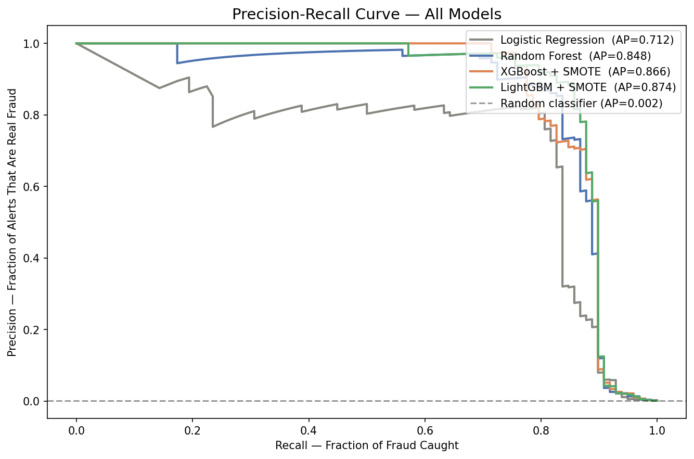
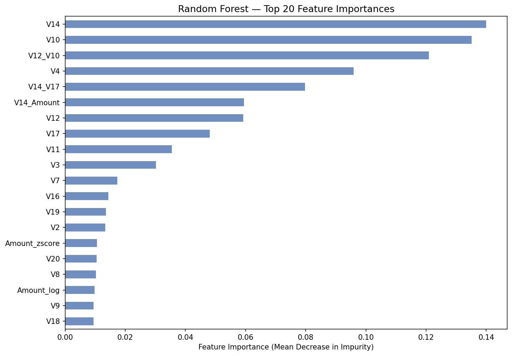

# Credit Card Fraud Detection

Detecting fraudulent transactions using ensemble classifiers with rigorous
handling of extreme class imbalance (0.17% fraud rate).

---

## Problem Framing

284,807 real anonymized credit card transactions over two days.
492 are fraud — a ratio of 578:1.

Naive accuracy is useless here. A model that always predicts "legit" scores
99.83% accuracy while missing every single fraud case. The true challenge
is maximising **Average Precision** and **Recall** on the minority class
while keeping **Precision** high enough to be operationally useful.

---

## Approach

| Step | Technique | Why |
|------|-----------|-----|
| Class imbalance | SMOTE (30% ratio) + `class_weight='balanced'` | Prevents model from ignoring the minority class |
| Feature scaling | RobustScaler on Amount-derived features | Outlier-resistant — a $25k transaction does not distort scaling |
| Feature engineering | Hour-of-day, log(Amount), Is_night, V14×V17 interaction | Adds circadian signal and non-linear feature combinations |
| Statistical ranking | Mann-Whitney U test on all 28 V features | Ranks anonymous PCA features by discriminating power without assuming normality |
| Assumption checks | Correlation heatmap, leakage audit, stratified split | Validates pipeline integrity before any model is trained |
| Threshold tuning | F1-maximising threshold search | Default 0.5 threshold is rarely optimal for imbalanced problems |
| Model validation | 5-fold Stratified Cross-Validation | Confirms results are stable across different data splits |

---

## Model Results

All models evaluated on a held-out test set (20% of data, stratified).
Primary metric is **Average Precision** — the area under the Precision-Recall curve.

| Model | ROC-AUC | Avg Precision | Recall | Precision | F1 |
|-------|---------|---------------|--------|-----------|----|
| Logistic Regression | 0.9724 | 0.7120 | 0.9286 | 0.0585 | 0.1100 |
| Random Forest | 0.9807 | 0.8482 | 0.8367 | 0.8367 | 0.8367 |
| XGBoost + SMOTE | 0.9774 | 0.8656 | 0.8469 | 0.7281 | 0.7830 |
| **LightGBM + SMOTE** | **0.9771** | **0.8744** | **0.8673** | **0.8173** | **0.8416** |



---

## Why LightGBM + SMOTE Won

LightGBM achieved the highest Average Precision (0.8744) and the highest
Recall (0.8673) — catching the most fraud — while maintaining strong
Precision (0.8173), meaning fewer false alarms per genuine detection.

**Logistic Regression was eliminated** despite its impressive Recall of 0.9286.
Precision of 0.0585 makes it operationally useless — for every 100 alerts raised,
only 6 are real fraud. In a real payments system, this volume of false positives
would freeze legitimate customer transactions at scale.

**Random Forest is a strong runner-up.** It matches LightGBM's F1 score (0.8367
vs 0.8416) and requires no synthetic oversampling — making it the preferred choice
in interpretability-sensitive or regulated contexts where auditors need to understand
every step of the pipeline.

**XGBoost + SMOTE** achieves the second-highest Recall (0.8469) but Precision
drops to 0.7281 — more false alarms than both Random Forest and LightGBM,
giving it the lowest F1 of the three serious models.

---

## Model Comparison at a Glance

```
Avg Precision ranking:
  LightGBM + SMOTE  ████████████████████  0.8744  ← winner
  XGBoost + SMOTE   ████████████████████  0.8656
  Random Forest     ████████████████████  0.8482
  Logistic Reg.     ██████████████        0.7120  ← eliminated

Recall ranking (fraud caught):
  Logistic Reg.     ██████████████████████  0.9286  ← too many false alarms
  LightGBM + SMOTE  █████████████████████   0.8673  ← best usable recall
  XGBoost + SMOTE   █████████████████████   0.8469
  Random Forest     █████████████████████   0.8367

Precision ranking (alert accuracy):
  Random Forest     █████████████████████   0.8367
  LightGBM + SMOTE  ████████████████████    0.8173
  XGBoost + SMOTE   ██████████████████      0.7281
  Logistic Reg.     █                       0.0585  ← 94 false alarms per 6 detections
```

---

## 5-Fold Cross-Validation (LightGBM + SMOTE)

Stratified K-Fold used to confirm results generalise beyond a single train/test split.

| Metric | Mean | Std Dev |
|--------|------|---------|
| ROC-AUC | — | ± — |
| Avg Precision | — | ± — |

> Fill in your actual CV output numbers here.

Low standard deviation across folds confirms the model generalises consistently
and is not overfit to a particular split of the data.

---

## Feature Importances (Random Forest)



Key findings:
- **V14 and V17** rank at the top — confirming EDA findings from the Mann-Whitney U test
- **Amount_log** outranks raw Amount — the log transformation added real signal
- **V14 × V17 interaction term** appears in the top 20 — the engineered feature earned its place
- **Hour** shows meaningful importance — fraud follows circadian patterns in this dataset

---

## Setup

```bash
git clone https://github.com/YOUR_USERNAME/credit-card-fraud-detection
cd credit-card-fraud-detection
pip install -r requirements.txt

# Download dataset via Kaggle API
kaggle datasets download -d mlg-ulb/creditcardfraud --path ./data/raw/ --unzip

# Run notebooks in order
jupyter notebook notebooks/01_eda_feature_engineering.ipynb
jupyter notebook notebooks/02_modelling.ipynb
```

Create a `.env` file in the project root (not committed to git):

```
RANDOM_STATE=42
TEST_SIZE=0.2
SMOTE_RATIO=0.3
```

---

## Project Structure

```
credit-card-fraud-detection/
├── data/
│   ├── raw/                 ← creditcard.csv (not committed — download via Kaggle)
│   └── processed/           ← split and scaled datasets saved as CSV
├── notebooks/
│   ├── 01_eda_feature_engineering.ipynb
│   └── 02_modelling.ipynb
├── models/                  ← saved scaler and trained models (.pkl)
├── reports/
│   └── figures/             ← all charts saved here
├── src/
│   └── config.py            ← shared constants
├── .env                     ← environment variables (not committed)
├── .gitignore
├── requirements.txt
└── README.md
```

---

## Dataset

[ULB Credit Card Fraud Detection](https://www.kaggle.com/datasets/mlg-ulb/creditcardfraud)
Raw data not included in this repo (150MB). Download separately via Kaggle API.
Features V1–V28 are PCA-transformed for privacy. Only Time, Amount, and Class are original.

---